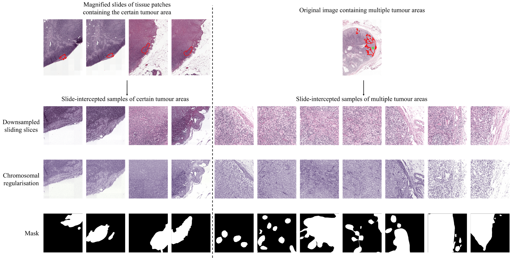

### Documentation

This is code for paper: HI-Net: a novel histopathologic image segmentation model for metastatic breast cancer
via lightweight dataset construction [doi: 10.1016/j.heliyon.2024.e38410](https://doi.org/10.1016/j.heliyon.2024.e38410)


The code includes how to generate the proposed dataset from annotated WSIs (Whole Slide Images) of dataset [Camelyon16, Camelyon17](https://camelyon17.grand-challenge.org/) and [ICIAR2018](https://iciar2018-challenge.grand-challenge.org/). It is expected to generate 7927 samples with masks of size 512x512 by this method.

### Methodology
Whole slide imaging (WSI) refers to the digitalization of entire microscope slides, which usually with a high-resolution containing more than 10 billion pixels.

To accelerate training and reduce computational costs, we construct a lightweight dataset mainly following these 4 steps:
1. Generate Masks via annotations
2. Cut the slides to patches with a sliding window and balance the distribution
3. normalize the color of patches
4. Shuffle images and distribute images to training, validation and test set





### Usage

to run the script, use the following commond

```bash
python main.py --root <root_directory> --save-path <save_directory> [--num-cpu <number_of_cpus>]
```
where,

`root` is the path that contains all slices and their annotations, you should put all files in the root folder

`save-path` is the path for saving results

`num-cpu` should be the number of core of your cpu


### Additional Requirement
#### OpenSlide
To run the code, you should install [openslide-win64-20171122](https://openslide.org/download/) And assign the path of the bin folder to the `OPENSLIDE_PATH`  in patched.py

#### ASAP
[ASAP2.1](https://computationalpathologygroup.github.io/ASAP/) is also required. And add the software's bin folder path to the `PYTHONPATH` in the system environment variable

#### ICIAR2018 Annotation Replacement
Since the ICIAR2018 dataset annotation's area is too large, we manually label the tumors with a more accurate boundary. New annotations can be found in `ICIAR2018-Our Annotation` folder.


We rename the annotation group name of original boundary to metastases_org, and the new boundary as newmeta.
